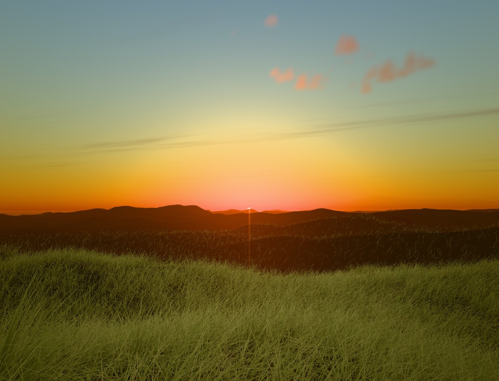
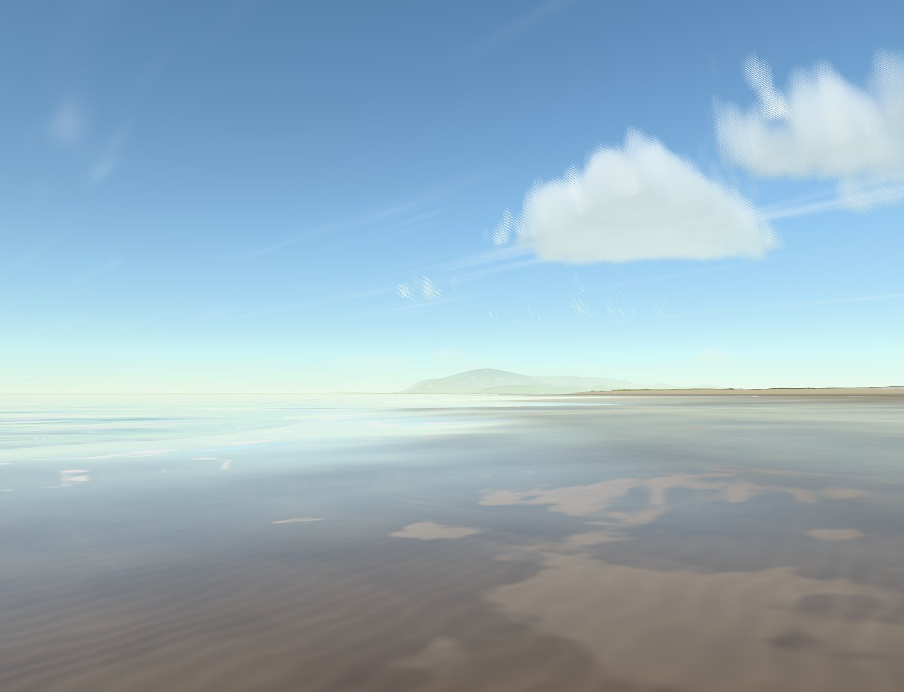
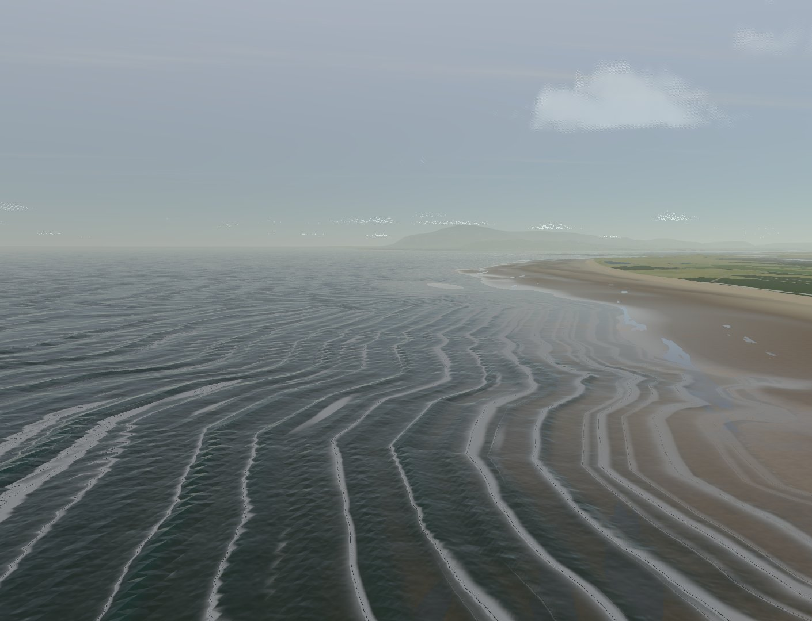
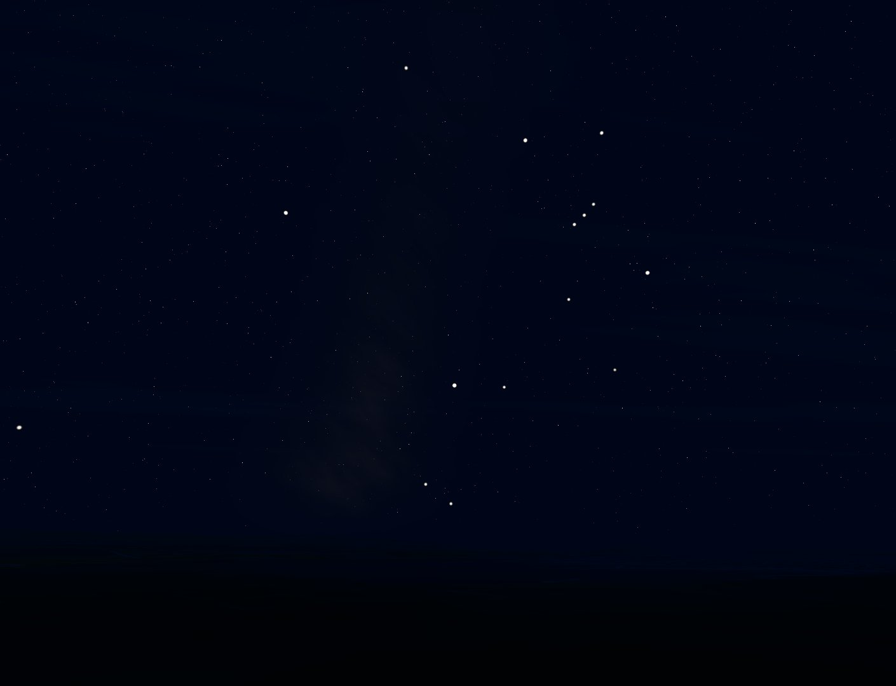

# Shoreline: Walney

**Painting my home coastline in code.** A creative-coding art piece, work in progress: north Walney Island and the Duddon estuary in Cumbria, looking toward Black Combe, rebuilt in the browser with three.js (WebGPU).

**▶ Visit: https://tekano.github.io/shoreline/**  
**▶ Just watch (a looping tour with sound): https://tekano.github.io/shoreline/walney/?play**



It's a "reality meme": take the real place and get the feeling right. The ground is real survey data, the colours come from my own photos, and the rest is painted with shaders: sky, sea, grass and light. It's made in conversation with [Claude Code](https://claude.com/claude-code), steering by eye the way you'd art-direct a shot. The [devlog](DEVLOG.md) tells the story.

| West Shore, wet sand and cumulus | A grey Irish Sea day | Orion over the dunes in January |
|---|---|---|
|  |  |  |

## What's real and what's painted

| Real | Painted |
|---|---|
| **Terrain:** Environment Agency 1–2 m LiDAR, dunes, flats, channels and Black Combe at true height | **Sky:** a physically based atmosphere (air, sea haze, ozone; Hillaire 2020) in real units, metered like a camera; ray-marched cumulus, an overcast deck |
| **Land cover:** OpenStreetMap saltmarsh, sand, tracks, roads and fields, plus 13,000 building footprints and the wind turbines | **Sea:** directional waves layered by distance, waves that bend to the real shoreline and break, lace whitewater, sun glitter and glints |
| **Sun and stars:** the true sun path and ~75 bright stars for any date and time over Walney, at their real brightness |
| **Night lights:** street lamps along the towns' mapped roads, floodlit BAE sheds, and the offshore wind farms' aviation lights, all at real intensities | **Marram:** ~270,000 blades moving in one shared wind, with hero tussocks up close |
| **Colours:** sampled from my own photos and a 360° pano from the Sandscale dunes | **Tide:** a real-height tide slider that floods the flats and marsh, with swash, pools and mirror-wet sand |

**Hero view:** the dune top at Sandscale Haws, where my pano was taken. Pick it from the **View** menu. Everything else is a bonus to explore.

## Run it locally

```sh
python tools/serve.py        # then open http://localhost:8792/  (it goes to walney/)
```

It needs a browser with WebGPU (current Chrome, Edge or Safari). [`walney/README.md`](walney/README.md) explains the terrain and land-cover pipeline (`terrain/`) and the camera tools.

## Where it started

Before Walney, Shoreline v0.1 combined two open-source projects into a beach-wave toy. It lives on at [`hybrid/`](https://tekano.github.io/shoreline/hybrid/):
- [Saltreach](https://github.com/iamtechartist/coastal-simulation)'s shallow-water simulation;
- [reality-js](https://github.com/aiimpl/reality-js)'s foam lace, water colour and glints.

Walney still uses ideas and code from both: the lace foam, glints and absorption. Its noise texture and vendored three.js come from Saltreach.

## Credits

- **Saltreach** © 2026 Techartist, MIT ([licence](third_party/saltreach-LICENSE)): the v0.1 base (solver, world, camera) and the noise texture.
- **reality-js** © 2026 ai_impl, MIT ([licence](third_party/reality-js-LICENSE)): the foam lace, absorption, surf-zone colour, crest light and glint ideas, ported from GLSL to TSL.
- **three.js** r185, MIT ([threejs.org](https://threejs.org)), vendored in `vendor/`.
- **lil-gui** 0.20, MIT ([licence](vendor/lil-gui/LICENSE)): the v0.1 look panel.
- **Terrain** © Environment Agency copyright and/or database right 2022, [Open Government Licence v3.0](https://www.nationalarchives.gov.uk/doc/open-government-licence/version/3/).
- **Land cover and buildings:** map data © OpenStreetMap contributors, [ODbL](https://opendatacommons.org/licenses/odbl/). The derived files in `walney/data/` share that licence.

## Licence

Code: MIT, see [LICENSE](LICENSE). Data: as credited above.
