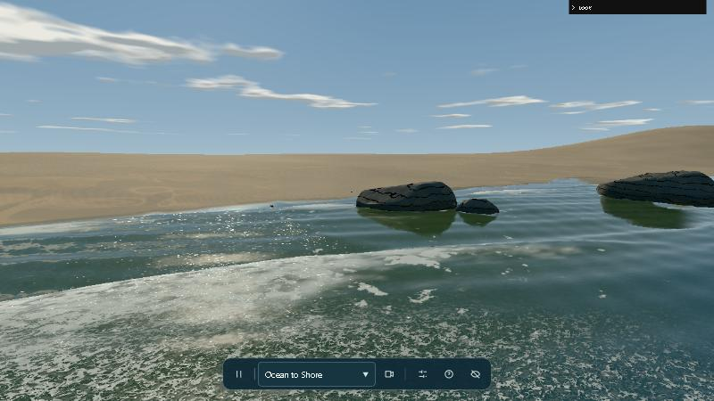
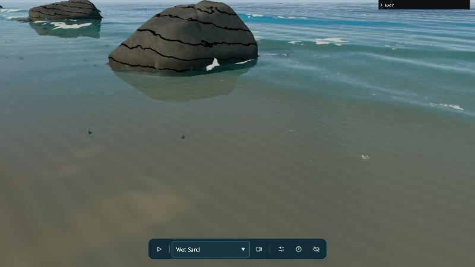
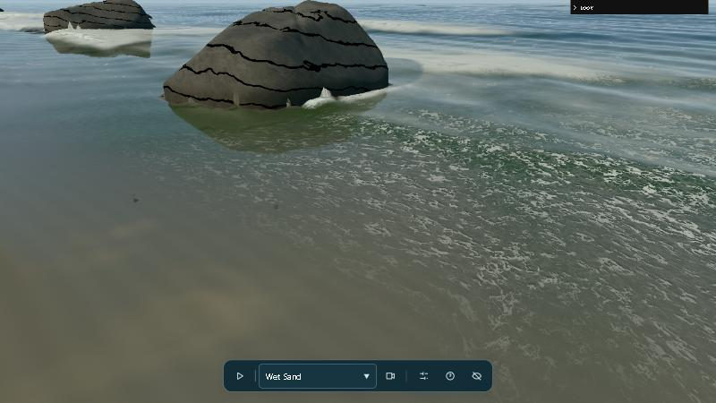

# Shoreline

Realtime breaking waves on a beach, in the browser. three.js on WebGPU, with a WebGL 2 fallback.

**Live demo: https://tekano.github.io/shoreline/**

Shoreline combines the best parts of two open-source projects and then builds on them:

- the **water physics** from [Saltreach](https://github.com/iamtechartist/coastal-simulation) by Techartist: a shallow-water solver where waves bend over the seabed, wrap around rocks and run up the sand, with foam carried along by the flow;
- the **look** from [reality-js](https://github.com/aiimpl/reality-js) by ai_impl: foam that breaks up into lace instead of fading, water that absorbs red first and turns sandy in the surf zone, light through the crests, and sun glints.

Both are MIT licensed; see [Credits](#credits). The direction from here is in the [devlog](DEVLOG.md).



| Saltreach original foam | Shoreline v0.1: lace foam, sandy surf zone |
|---|---|
|  |  |

## Walney: a real place

The scene is moving to a real location: north Walney Island and the Duddon estuary, looking toward Black Combe in Cumbria. [`walney/`](walney/) is a blockout of the real terrain from Environment Agency LiDAR, with a top-down map for placing camera views ([live](https://tekano.github.io/shoreline/walney/)).

## Run it

Any static server works. This one turns caching off so shader edits show on reload:

```sh
python tools/serve.py        # then open http://localhost:8792
```

It needs a browser with WebGPU (current Chrome, Edge or Safari). Add `?webgl=1` to the URL to force WebGL 2.

## Controls

- **Moving around:** drag to look, `W A S D` to walk, `Shift` to move faster, scroll to step forward or back.
- **Keys:** `Space` pauses, `C` cycles viewpoints, `H` hides all panels.
- **Look panel (top right):** every slider drives the shader live:
  - **View layer:** see one layer on its own: the simulated foam amount, the foam pattern, water depth or flow.
  - **Sun:** elevation and azimuth.
  - **Foam lifetime:** how fast fresh and lingering foam die off in the simulation.
  - **Foam pattern:** lace scale, thread width, sheet threshold, breakup, warp, re-form period, relief and shadows.
  - **Whitewater:** where dense foam turns into a solid lumpy mass.
  - **Water body:** absorption per channel, clear and sandy colours, surf-zone depth.
  - **Crest light** and **Surface:** reflection, glints, foam sparkle.
  - **Presets:** save, load, copy and paste as JSON. `Saltreach original` gives you the upstream look for A/B comparison.

## How it works

| Part | What it does | Where |
|---|---|---|
| Solver | Shallow-water equations on a 241 × 401 grid (0.3 m cells) at 60 Hz, in a worker with WebAssembly kernels. Waves are forced at the open edges. Rocks are just raised seabed, so the water flows around and over them | `src/simulation.js`, `src/solver-kernels.ts` |
| Foam amount | Created where a bore steepens, where the swash advances and where water hits rocks. Fresh foam feeds lingering foam. Both ride the flow | `transport()` in `src/simulation.js` |
| Flow-carried coordinates | Texture coordinates carried by the flow, so the foam pattern stretches and drains with the water | `qx/qz` in `src/simulation.js` |
| Foam pattern | The foam amount sets the pattern: a sheet with holes, then threads from noise contours, then snapped threads. Two layers swap so it keeps re-forming | `lace()` in `src/look.js` |
| Water colour | Light absorbed along the view path, cloudy sandy water in the surf zone, green glow through steep crests | `src/shading.js` |
| Glints | Tiny facets with random slopes. Only those tilted to mirror the sun light up | `glints()` in `src/look.js` |

Changes from the upstream code are commented where they happen. `src/look.js` and `src/panel.js` are new.

## Credits

- **Saltreach** © 2026 Techartist, MIT ([licence](third_party/saltreach-LICENSE)): the base of this repo, including the solver, world, camera, sky, sand and rocks.
- **reality-js** © 2026 ai_impl, MIT ([licence](third_party/reality-js-LICENSE)): the foam lace, absorption, surf-zone colour, crest light and glint shaders, ported from GLSL to TSL.
- **three.js** r185, MIT ([threejs.org](https://threejs.org)), vendored in `vendor/`.
- **lil-gui** 0.20, MIT ([licence](vendor/lil-gui/LICENSE)): the look panel.
- **Terrain** © Environment Agency copyright and/or database right 2022, [Open Government Licence v3.0](https://www.nationalarchives.gov.uk/doc/open-government-licence/version/3/).

## Licence

MIT, see [LICENSE](LICENSE).
